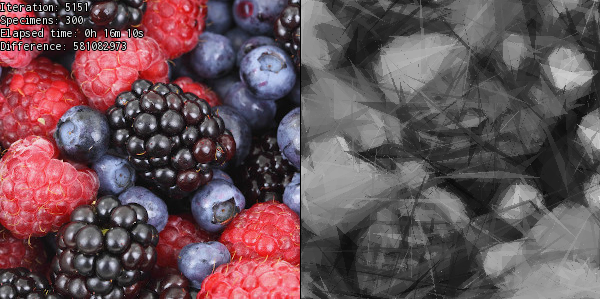
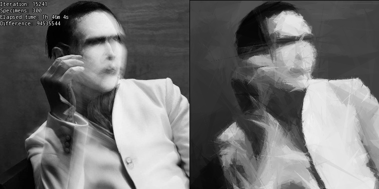
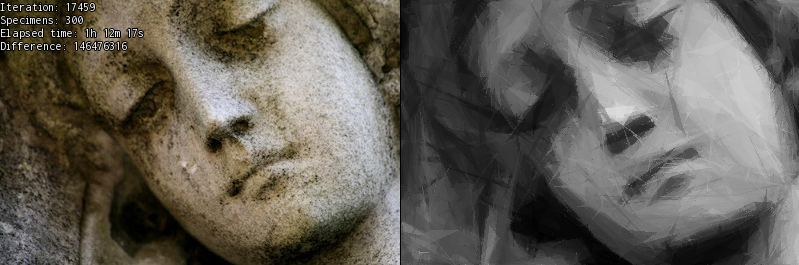
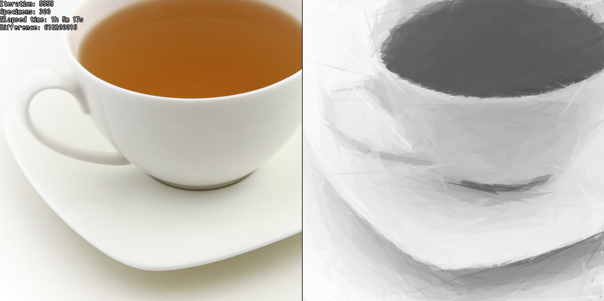

# Genetic Image
A simple exercise project which uses a very basic genetic algorithm to evolutionary recreate an input image.

The original idea: [Genetic Programming: Evolution of Mona Lisa](https://rogerjohansson.blog/2008/12/07/genetic-programming-evolution-of-mona-lisa/).
The livestream which inspired me: [[PL] Gynvael's Livestream #28: Mona Lisa genetycznie](https://youtu.be/7zI7M_5_jBE).

SFML library required.

## Gallery

    
    
    
